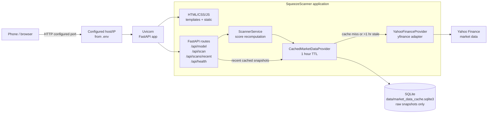
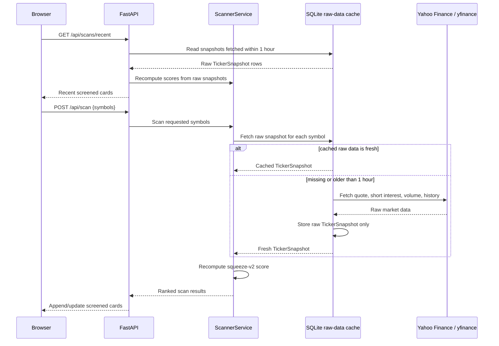

# Architecture

## Request flow

## Key design points

- `uv` manages dependencies and the `squeeze-scanner` console script.
- Network binding, port, reload mode, cache path, and cache TTL are configured through `.env`; `.env.example` documents the supported variables.
- Uvicorn auto-reload can watch `app/`, `templates/`, and `static/` during development.
- Browser, static, and API responses use `Cache-Control: no-store` to prevent stale UI assets.
- The frontend gets signal labels, weights, descriptions, calculations, tooltips, and legend data from the Python scoring model via `/api/model` and each response `model` block.
- SQLite stores raw financial-service snapshots plus `fetched_at` and `scanned_at` timestamps. Scores, risk labels, components, rationale, and rendered UI state are never cached.
- `/api/scans/recent` returns all tickers screened within the current TTL and recomputes their scores with the current model.
- `/api/scan` uses cached raw data for fresh symbols and fetches Yahoo Finance only for new or stale symbols.
