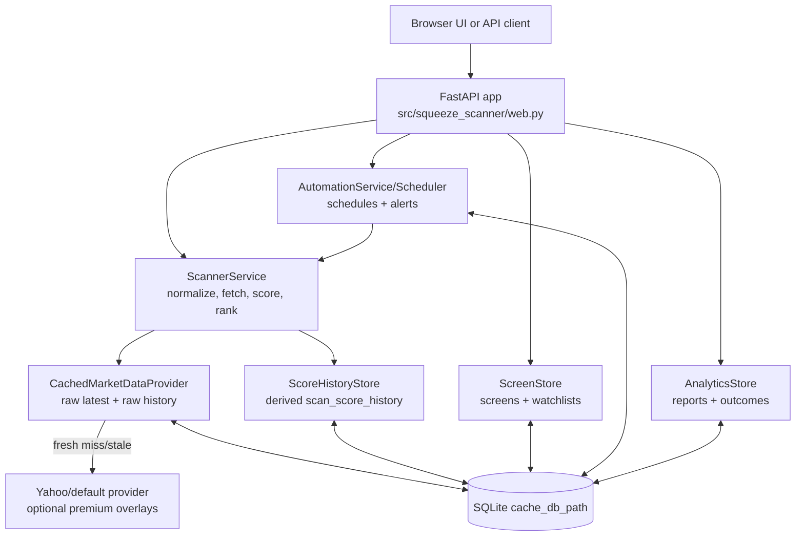

# Architecture and Data

This document explains how Squeeze Scanner runs, how data moves through the system, and which invariants future human maintainers and AI coding agents should preserve.

## Primary source files

- `readme.md` — user-facing setup, runtime settings, API overview, cache/scoring summary.
- `ARCHITECTURE.md` — existing component and request-flow diagrams.
- `ROADMAP.md` — shipped status, data model inventory, integration constraints.
- `src/squeeze_scanner/web.py` — FastAPI app factory, routes, service wiring, status payloads.
- `src/squeeze_scanner/domain.py` — shared dataclasses, provider protocols, `TickerSnapshot`, `ScanResult`.
- `src/squeeze_scanner/cache.py` — raw market-data SQLite cache and raw snapshot history.
- `src/squeeze_scanner/history.py` — derived score-history persistence and score-delta queries.
- `src/squeeze_scanner/screens.py` — saved screens and watchlists.
- `src/squeeze_scanner/automation.py` — schedules, scheduled runs, alerts, alert events, delivery attempts.
- `src/squeeze_scanner/analytics.py` — price history, scan outcomes, calibration, report queries.
- `src/squeeze_scanner/service.py` — scanner orchestration, ranking, score-history writes, recomputation.

## Runtime architecture

Squeeze Scanner is a local-first FastAPI application. `src/squeeze_scanner/web.py:create_app()` loads settings, builds the selected market-data provider, wraps it in `CachedMarketDataProvider`, then wires `ScannerService`, `ScoreHistoryStore`, `AnalyticsStore`, `ScreenStore`, `AutomationService`, and `AutomationScheduler` against the same SQLite database path.



### Main components

| Component | File | Responsibility |
| --- | --- | --- |
| FastAPI app | `src/squeeze_scanner/web.py` | Defines browser route, API routes, no-store cache headers, health/status payloads, owner defaults, and startup/shutdown scheduler hooks. |
| Domain model | `src/squeeze_scanner/domain.py` | Defines provider protocols, `TickerSnapshot` raw inputs, option-chain records, `ScanResult` derived outputs, guardrail config, and shared errors. |
| Scanner orchestration | `src/squeeze_scanner/service.py` | Normalizes symbols, fetches snapshots concurrently, scores each snapshot, records score history, computes deltas, ranks and shapes responses. |
| Raw cache | `src/squeeze_scanner/cache.py` | Stores latest raw `TickerSnapshot` JSON per provider/symbol plus append-only refreshed raw snapshots. Does not store derived scores. |
| Score history | `src/squeeze_scanner/history.py` | Stores point-in-time derived scan results keyed to raw snapshot references and scoring model version. |
| Screens/watchlists | `src/squeeze_scanner/screens.py` | Persists saved screen filters and local watchlist membership with optional `owner_id`. |
| Automation | `src/squeeze_scanner/automation.py` | Persists scheduled scan definitions/runs, alert rules/events, and external delivery attempts. |
| Analytics | `src/squeeze_scanner/analytics.py` | Persists price bars/outcomes and reads score history for reports, calibration, deltas, and CSV exports. |

## Request and scan flow

### Manual scan: `POST /api/scan`

1. `web.py` accepts `ScanRequest` (`symbols`, optional ranking fields) and calls `ScannerService.scan()` in a worker thread.
2. `ScannerService` normalizes comma/space/semicolon-separated tickers and rejects invalid or excessive symbol lists.
3. Symbols are fetched concurrently through the configured `MarketDataProvider`; in normal runtime this is `CachedMarketDataProvider`.
4. `CachedMarketDataProvider.fetch()` returns a fresh cached raw snapshot when `now - fetched_at <= ttl_seconds`; otherwise it fetches from the provider, upserts `market_data_cache`, and appends to `market_data_history`.
5. Each raw `TickerSnapshot` is scored with `score_snapshot()` into a `ScanResult` containing four model scores, components, rationales, metrics, confidence, risk flags, and warnings.
6. `record_score_history()` asks the cache for `raw_history_references()` and writes one `scan_score_history` row per scored result.
7. `ScoreHistoryStore.score_deltas()` adds previous-scan and 24-hour deltas when enough history exists.
8. `build_scan_response()` returns model metadata, ranking metadata, sorted results, scan timestamps, deltas, and per-symbol errors.

### Recent scans: `GET /api/scans/recent`

`web.py` reads `CachedMarketDataProvider.recent_snapshots()`, which selects latest cache rows whose `COALESCE(scanned_at, fetched_at)` is within the TTL. The endpoint recomputes scores from the raw snapshots with the current scoring code and asks the scanner for existing deltas. This keeps recent results current with model changes and avoids caching rendered UI state.

### Yahoo most-shorted: `POST /api/scan/most-shorted`

`web.py` asks `YahooFinanceScreener` for a candidate universe and passes those symbols through the same `ScannerService.scan()` path. Cache, score-history, delta, and ranking behavior are identical to a manual scan.

### Saved watchlist scan

`POST /api/watchlists/{watchlist_id}/scan` loads symbols from `ScreenStore`, applies optional owner filtering, and passes the symbols into the same scanner path. Empty watchlists return an empty scan response shaped by `build_scan_response()`.

### Scheduled scans and alerts

`AutomationScheduler` is started on FastAPI startup when enabled. It polls due `scheduled_scans`, runs the configured target through `AutomationService` and `ScannerService`, writes `scheduled_scan_runs`, evaluates alert rules against results, creates/deduplicates `alert_events`, and optionally records `alert_delivery_attempts` through configured delivery channels.

### Delete current scan row

`DELETE /api/scans/{symbol}` deletes the symbol only from `market_data_cache`. It removes the ticker from the current/recent UI but intentionally does not delete `market_data_history` or `scan_score_history`.

## Caching model

The cache separates raw provider data from derived scores.

| Table | Writer | Purpose |
| --- | --- | --- |
| `market_data_cache` | `CachedMarketDataProvider._write()` | Latest raw snapshot per `(provider, symbol)` for fast current scans. |
| `market_data_history` | `CachedMarketDataProvider._write_history()` | Refreshed raw snapshots over time, unique by `(provider, symbol, fetched_at)`. |

Important behavior:

- `fetched_at` is a Unix timestamp for when raw provider data was refreshed.
- `scanned_at` is a Unix timestamp for when the app last scanned/touched the symbol.
- Cached hits update `scanned_at` but do not create a new raw history row.
- Stale or missing rows fetch from the provider and write both latest and history rows.
- Corrupt latest payloads are ignored and removed from `market_data_cache`; corrupt historical payloads are skipped during historical reads.
- Derived values such as score, risk level, components, rationale, model confidence, and rendered card state are not stored in raw cache tables.

## Score-history flow

`scan_score_history` is the point-in-time record of the scoring model's interpretation of a raw snapshot.

```text
TickerSnapshot in market_data_history
        │ raw_history_id + raw_fetched_at + provider
        ▼
score_snapshot(snapshot)
        │ ScanResult with scores, metrics, warnings, confidence, risk flags
        ▼
ScoreHistoryStore.record_scan_result(..., scoring_model_version, scan_run_id)
        │ de-duplicated by provider/symbol/raw_fetched_at/model version/run id
        ▼
scan_score_history row
        │
        ├─ ScoreHistoryStore.score_deltas(): previous scan + 24h deltas
        └─ AnalyticsStore: reports, calibration, model-version comparison
```

Key fields:

- `symbol`, `company_name`, `provider` identify the scanned security and raw data source.
- `raw_history_id` and `raw_fetched_at` link the derived score back to a raw snapshot.
- `scoring_model_version` preserves which scoring code produced the row.
- `scan_run_id` distinguishes live scans from recompute runs.
- `primary_model`, `score`, `risk_level`, `data_quality` are queryable scalar columns.
- JSON columns preserve full model scores/components/rationales/confidence, metrics, risk flags, and warnings.

`POST /api/scans/recompute` reads `market_data_history`, re-scores historical raw snapshots with the current model, and writes new score-history rows under a `recompute:<timestamp>` scan run id. This supports model comparison without mutating old rows.

## SQLite tables

All major local state uses the configured SQLite database, defaulting to `data/market_data_cache.sqlite3` per the README. Stores open independent SQLite connections and create/migrate their tables lazily.

| Table | File/store | Stores |
| --- | --- | --- |
| `market_data_cache` | `cache.py` | Latest raw `TickerSnapshot` JSON per provider/symbol, `fetched_at`, `scanned_at`. |
| `market_data_history` | `cache.py` | Historical raw `TickerSnapshot` JSON snapshots, one row per refreshed provider/symbol/fetch time. |
| `scan_score_history` | `history.py`, read by `analytics.py` | Derived point-in-time scan results, raw references, model version/run id, scalar score fields, JSON detail fields. |
| `saved_screens` | `screens.py` | Saved screen names, optional owner, filter/ranking JSON, create/update timestamps. |
| `watchlists` | `screens.py` | Watchlist names, optional owner, create/update timestamps. |
| `watchlist_symbols` | `screens.py` | Watchlist membership with `(watchlist_id, symbol)` primary key. |
| `scheduled_scans` | `automation.py` | Schedule metadata: optional owner, name, target type/payload JSON, interval, enabled flag, last/next run. |
| `scheduled_scan_runs` | `automation.py` | Run lifecycle, scanned symbols JSON, errors JSON, result count, response JSON, error message. |
| `alerts` | `automation.py` | Optional owner, alert name, rule JSON, enabled flag, delivery channel JSON. |
| `alert_events` | `automation.py` | Triggered alert condition, symbol, score-history/run references, result JSON, ack/clear state. |
| `alert_delivery_attempts` | `automation.py` | External delivery status per event/channel, destination, retry count, response/error JSON. |
| `price_history` | `analytics.py` | OHLCV bars by symbol/provider/observed time for backtesting and outcomes. |
| `scan_outcomes` | `analytics.py` | Forward return/excursion/gap/volume outcomes by scan row, model, version, and horizon. |

## JSON payload strategy

SQLite stores query-critical fields as scalar columns and flexible/evolving payloads as JSON text.

- Raw snapshots: `market_data_cache.payload_json` and `market_data_history.payload_json` contain `dataclasses.asdict(TickerSnapshot)` with sorted keys.
- Raw snapshot loading is tolerant: `snapshot_from_json()` iterates current `TickerSnapshot` fields, supplies defaults or default factories for missing fields, normalizes source metadata maps/lists, and normalizes option-chain records.
- Score details: `scan_score_history` stores `model_scores_json`, `model_components_json`, `model_rationales_json`, `model_confidence_json`, `metrics_json`, `risk_flags_json`, and `warnings_json`.
- Source provenance is folded into score-history metrics under `_field_sources`, `_field_quality`, and `_source_quality` when present.
- UI/user objects: saved screen `filters_json`, schedule `target_json`, scheduled run `symbols_scanned_json`/`errors_json`/`response_json`, alert `rule_json`/`delivery_channels_json`, alert event `result_json`, and delivery attempt `response_json` allow API shapes to evolve without table rewrites.
- JSON payloads must be JSON-serializable. Screen filters are normalized through JSON round-tripping and compact sorted dumps.

## Schema migration and backward compatibility

The code uses additive, idempotent SQLite migrations rather than destructive migrations.

Invariants:

- Stores call `CREATE TABLE IF NOT EXISTS` before use.
- `_ensure_columns()` helpers inspect `PRAGMA table_info(...)` and `ALTER TABLE ... ADD COLUMN` only for missing columns.
- `cache.py` adds `scanned_at` to old `market_data_cache` tables and backfills it from `fetched_at`.
- `cache.py` seeds `market_data_history` from existing latest cache rows with `INSERT OR IGNORE`.
- Unique constraints and `INSERT OR IGNORE` avoid duplicate raw history and score-history rows.
- JSON readers must tolerate missing keys, old field names, malformed optional JSON, and absent new dataclass fields.
- Migrations should not rewrite or delete existing user data unless a future migration explicitly documents a safe lifecycle policy.

## Owner metadata and local auth boundary

The app is still local/unauthenticated (`auth_required=false` in status), but several tables have optional `owner_id` for future auth integration.

- Owner-aware resources: `saved_screens`, `watchlists`, `scheduled_scans`, and `alerts`.
- Create endpoints use request `owner_id` if supplied; otherwise they apply `SQUEEZE_SCANNER_DEFAULT_OWNER_ID` when configured.
- Blank or whitespace owner values normalize to `None`.
- List/get/delete operations filter by owner only when an owner is provided. Omitting owner preserves single-user local behavior and returns local resources broadly.
- Status payloads expose `owner_scoping_available=true` and whether a default owner is configured.

Do not treat `owner_id` as authentication. It is metadata/filtering only until an external auth/session layer is added.

## Data lifecycle

1. **Provider ingestion:** New or stale scans fetch raw market data from Yahoo or a configured provider overlay.
2. **Latest cache update:** `market_data_cache` is upserted for the provider/symbol.
3. **Raw history append:** A refreshed raw snapshot is inserted into `market_data_history` once per provider/symbol/fetch timestamp.
4. **Scoring:** Scores are recomputed from raw snapshots every scan or recent-load response.
5. **Derived history:** Live scans write `scan_score_history`; recomputes write additional rows under recompute run ids.
6. **User state:** Screens, watchlists, schedules, alerts, runs, events, and delivery attempts persist until explicit deletion or database cleanup.
7. **Analytics:** Price bars and outcomes are inserted separately. Outcome generation reads stored score rows and price bars only; it does not fetch live data or rescore snapshots, which avoids lookahead bias.
8. **Current-row deletion:** Deleting a scan removes only the latest cache row. Historical raw snapshots, score history, reports, alerts, and outcomes remain available.

There is no built-in retention/purge policy in the inspected stores. The SQLite database is the durable local state boundary.

## AI-agent invariants

When changing this repository, preserve these rules unless the product requirements explicitly change:

- Keep raw provider snapshots and derived scores separate.
- Never cache rendered UI/card state.
- Keep `TickerSnapshot` additions backward-compatible with old JSON payloads by providing safe defaults/default factories and tolerant loaders.
- Add SQLite columns/tables idempotently; avoid destructive migrations.
- Preserve score-history provenance: provider, symbol, raw fetch timestamp, raw history id, scoring model version, and scan run id.
- Do not let missing premium data create bullish signals; represent it as missing data, lower confidence, or warnings/risk flags.
- Keep provider credentials out of source, payloads, and `/api/providers` responses.
- Treat `owner_id` as optional metadata, not authentication.
- Maintain `Cache-Control: no-store` behavior for browser/static/API responses to avoid stale frontend assets.
